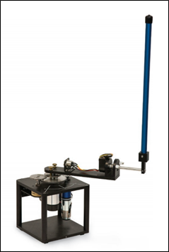

# Applied Neural Networks Final Project

## Dr Watson: A Study in Scraping
* Project Goal: Train a BERT language model to generate \
Doylesque text using open-domain Sherlock Holmes stories. \
Generated text then fed as input to voice clone and audio \
animated as Dr Watson.
* Docs in "drWatson" directory
* Alternate Subtitles:
	* "Hound of the Batch's Files"
	* "The Reichenback Props"

## Old Project: Rotary Inverted Pendulum
* Project Goal: Train a neural network with reinforcement \
learning to vertically stabilize a pendulum offline
* Project retired after a global health crisis
* Docs in "pendulum" directory

