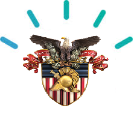

# Applied Neural Networks Final Project

## Wesson: Tackling Jeopardy!
* Project Goal: Train a model to process natural language \
"answers" and formulate an appropriate "question" within \
a reasonable time scale
* Docs in "wesson" directory
* Wesson:

## Old Project: Rotary Inverted Pendulum
* Project Goal: Train a neural network with reinforcement \
learning to vertically stabilize a pendulum offline
* Project retired after a global health crisis
* Docs in "pendulum" directory
* Pendulum:

