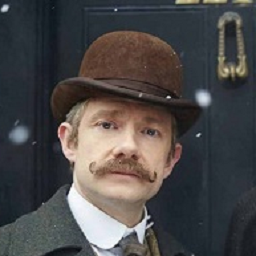

# Dr Watson: A Study in Scraping
* Project Goal: Train a BERT language model to generate \
Doylesque text using open-domain Sherlock Holmes stories. \
Generated text then fed as input to voice clone and audio \
animated as Dr Watson.

## Directory Structure:
* 'scraper' = Selenium/BS4 web scraper for Sherlock Holmes corpus
* 'text_gen' = Sherlock Holmes corpus, language model code
* 'voice' = voice cloning code, voice clone embedding
* 'puppetry' = deepfake code
* 'samples' = generated examples, training samples

<!-- https://help.smash.gg/en/articles/1987102-customizing-text-with-markdown -->