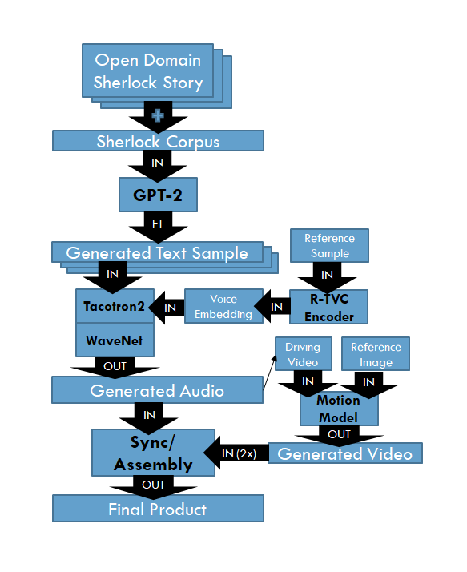

# Dr Watson: A Study in Scraping
* Project Goal: Train a BERT-style language model to generate Doylesque text using open-domain Sherlock Holmes stories. Generated text then fed as input to voice clone and audio animated as Dr Watson.

## Directory Structure:
* 'motion_model' = first-order motion model code
* 'samples' = tuned examples, training samples
* 'scraper' = Selenium/BS4 web scraper for Sherlock Holmes corpus
* 'text_gen' = Sherlock Holmes corpus, language model code
* 'voice' = voice cloning code, voice clone embedding
* 'presentations.zip' = final slides, final video, IPR2 slides
* 'watson.ipynb' = all Jupyter Notebooks compiled into one
* 'README.md' = please see README for further information on this file

## Model Structure:
1. **Text Generation**:
	* Uses [GPT-2](https://openai.com/blog/better-language-models/) 124M parameter model 
	* Trained on all open-domain [Sherlock Holmes canon](text_gen/sherlock.txt) ([scraped](scraper/sherlock_scraper.ipynb) from [Project Gutenberg](http://www.gutenberg.org/ebooks/author/69))
	* [Fine-tuned](text_gen/watson_text.ipynb) with help from [gpt-2-simple](https://github.com/minimaxir/gpt-2-simple) API
	* [Generated samples](samples/text_samples/tuned_samples)
2. **Voice Cloning**:
	* [49 minute sample](samples/voice_samples/training_samples) of Martin Freeman's voice (drawn from [audiobook repo](https://github.com/GSimas/Hitchhiker/tree/master/2%20-%20The%20Restaurant%20at%20the%20End%20of%20the%20Universe)) input to [Real-Time Voice Cloning](https://github.com/CorentinJ/Real-Time-Voice-Cloning) speaker encoder as unlabeled reference audio
	* [Encoder](voice/real_time_voice_cloning.ipynb) outputs voice embedding tensor (stored at voice/embedding_8.npy)
	* Text and embedding inputs then [synthesized](voice/watson_voice.ipynb) and converted to [audio](samples/voice_samples/tuned_samples)
3. **Motion Transfer**:
	* Record 256x256 clip for ["driving video"](samples/video_samples/training_samples/driving_videos)
	* Reference image should also be sized 256x256 (as in below graphic)
	* Driving video and reference image input to [first-order motion model](motion_model/first-order-motion-model.ipynb)
	* Motion from driving video extracted and applied to reference image, outputs [here](samples/video_samples/training_samples/gen_samples) (at 0.5 speed)
4. **Assembly**:
	* Speed-up generated clip 2x
	* Sync with audio in video-maker tool
	* [Final samples](samples/video_samples/tuned_samples)

## Dependencies:
* Pre-written into Jupyter Notebooks!
* Open all .ipynb files in Google Colab for free GPUs!

Author:
--------------
CDT(P) Wesley Swain, reach him at wswain40@gmail.com

<!-- https://help.smash.gg/en/articles/1987102-customizing-text-with-markdown -->